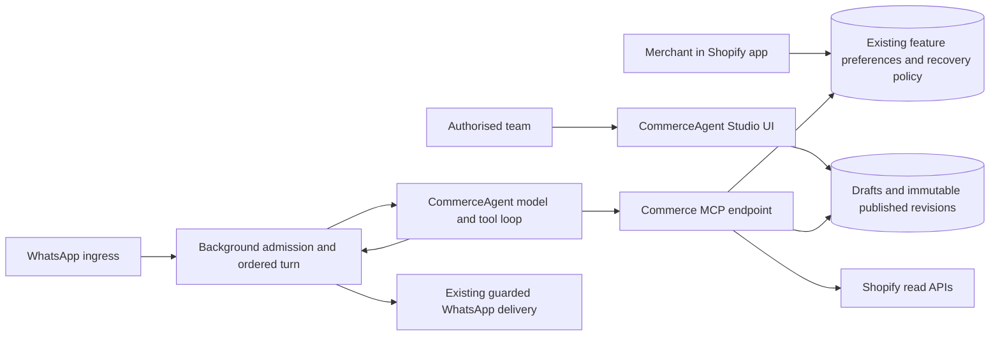

# ARCH-020: CommerceAgent Studio and merchant-configured MCP capabilities

## Status

Architect task-review update (2026-09-20): COMMERCE-001 is architect-accepted Complete at Attempt 3 (`d7c1c65`). The descendant-process cleanup correction passed focused functional validation; prior real Docker PostgreSQL/Redis readiness evidence is retained. COMMERCE-002 is architect-accepted Complete at Attempt 2 (`fb3362e`): development HTTP mutations and revoked-session recovery are corrected. Live Google OAuth remains developer-owned deployment validation. Downstream source consumption awaits developer integration or explicit accepted-commit approval; no task is promoted or launched. COMMERCE-001 remains accepted and integrated. Other task rows retain this branch snapshot; canonical task worktrees remain authoritative.

Proposed implementation design for developer review. The developer has selected
the separate Next.js repository/submodule `moda-interact-commerce`, a team-only
frontend, and a nested `database/` submodule pointing to the existing
`moda-interact-database` repository. UI name: CommerceAgent Studio. Logical owner:
`moda_commerce`; task domain: `commerce` / `COMMERCE`.

**Rollout: PRE-PRODUCTION / BREAKING ROLLOUT.** On 2026-09-20 the developer
confirmed that backwards compatibility is not required. Replace the existing
hard-coded agent capability path in one coordinated pre-production release;
do not build legacy prompt/tool fallback adapters. This is not permission to
delete database contents, recreate durable resources, or discard unrelated jobs.

**Task-definition VCS exception:** the developer explicitly requested ARCH-020
architecture and task definitions on workspace `main` for review. This packet
is authored in the current local `main` working tree, not in parent task
worktrees. It does not claim task-branch materialisation, implementation,
remote publication, or permission to execute these tasks. Normal mirrored task
branches, physical isolation, claims and review apply when execution begins.
See [implementation handoff](ARCH-020-implementation-handoff.md).

## Reconciled Studio authoring scope

Admin retains dynamic Feature ownership. Studio authors independently versioned
reusable tools, associates exact versions with feature behaviour, and provides
integrated Shopify discovery and schema-driven query authoring. See the
[binding page/traversal specification](ARCH-020-studio-ui-design.md) and
[verified Admin ownership review](ARCH-020-admin-feature-ownership-review.md).
C14/C15 and all affected tasks are reconciled to this design; the development
product/discount examples are not a fixed production feature catalogue.

## Binding implementation companion

[Implementation contracts](ARCH-020-implementation-contracts.md) C0–C15 define
exact cross-repository wire shapes, routing and clarification guards, budgets,
operations, routes, configuration and validation expectations. Read them with each
task. These are review-draft requirements, not claims of implementation. All 19
tasks have task-specific guidance/evidence. WhatsApp routing uses existing
records and lightweight Redis clarification guards; no additional database task.

## Problem

The Background CommerceAgent currently embeds its prompt, tool registration,
model-loop constraints and product-search integration in worker code. Merchant
feature selection cannot dynamically supply behaviour. Improving an offer-help
prompt or adding a compatible commerce tool requires a Background deployment.

The desired experience is: a merchant selects features in the Shopify app; the
team publishes feature behaviour in Studio; the agent retrieves the applicable
instructions/tools over MCP and uses them on that merchant's behalf.

## Goals

- Independently deploy commerce tool implementations in a separate submodule.
- Publish versioned instructions and capability settings without redeploying
  Background or Commerce; draft content must never leak into customer turns.
- Resolve capabilities from existing merchant feature and recovery-policy state.
- Deliver product discovery and discount assistance, including qualifying and
  similar product suggestions when the current basket does not meet an offer.
- Let authorised staff inspect, edit, preview, publish and roll back capability
  revisions through a Next.js UI.
- Preserve existing tenant ownership, conversation ordering, language handling,
  billing/admission safeguards and final WhatsApp delivery in Background.

## Non-Goals

- Moving the production LLM loop, queues or WhatsApp delivery into Next.js.
- A merchant-facing Studio, a second merchant feature catalogue, billing rules,
  discount catalogue synchroniser or recovery-policy override system.
- Arbitrary executable JavaScript/SQL, arbitrary-host URLs or third-party MCP
  servers configured through the UI. C14 validated read-only Shopify GraphQL
  definitions are supported; execution engines remain reviewed Commerce code.
- Applying discounts, mutating carts/checkouts, creating codes, placing orders,
  sending WhatsApp messages from MCP, or changing existing recovery billing.
- RAG/vector infrastructure, general workflow builders, support escalation,
  per-shop bespoke prompt editors or every Shopify discount type in v1.

## Current Architecture and Evidence

Inspected local source on 2026-09-20; this records working-tree behaviour, not a
claim that all inspected changes are committed, accepted or deployed. Workspace
HEAD was `3ffc6a58ce0e3b88f0ca06aa511472f4db334a63`; fetched `origin/main` was
`1632cd76ae7fa8b296c6a863a3861c4fb64b01f7` (23 commits ahead). Unrelated local
submodule changes were present and were not integrated by this design task.

| Evidence | Finding / implication |
|---|---|
| `moda-interact-background/src/agents/commerce.agent.ts` | Groq model from environment, hard-coded prompt, `searchProducts` and `finalResponse`, 800 output tokens, six steps; forces final response after a product search. This must change for multi-tool discount reasoning. |
| `src/workers/whatsapp.worker.ts` in Background | Directly injects `runCommerceAgent` into the turn processor. The LangGraph pipeline file is not the observed worker entry path. |
| `src/services/conversation-turn-processor.service.ts` in Background | Orders/coalesces turns, claims a 120-second lease, enforces admission, rejects stale results and sends through the existing outbound service. Keep this ownership. |
| `src/agents/types.ts` in Background | Current context lacks a validated basket-line contract and includes sentinel-recovery branches. ARCH-020 does not adopt those branches: its MCP boundary requires a real checkoutRecoveryId and recovery-linked WhatsApp conversation. |
| `src/tools/search-product.ts`, `src/services/shopify.service.ts` in Background | Local Shopify product search returns product-level price ranges and inventory. This does not prove variant eligibility or market-specific offer savings. |
| Shared `src/whatsapp.ts` and `src/whatsapp.test.ts`; `src/billing.ts` status schema | Inbound v1 already supplies nullable contextMessageId and sender/customer identifiers and rejects business IDs; status v2 is separate. Reuse both unchanged (C0). |
| `moda-interact-database/prisma/schema.prisma` | Existing `Feature`, plan mappings, `ShopFeaturePreference`, `ShopSettings`, recovery-policy overrides, `ShopifyDiscount`, `CheckoutRecovery.lineItems` and `PlatformAdmin` can be reused. |
| Background `src/services/effective-billing-policy.service.ts` | Active plan feature mappings and merchant opt-ins already contribute effective feature keys. Do not duplicate or replace billing admission. |
| Background `src/providers/shopify-discount.provider.ts` | Catalogue query fetches title/status/dates/summary/code metadata; it does not fetch enough rules to prove product, collection, customer or minimum-spend eligibility. |
| Background `src/services/recovery-policy.service.ts` | Existing merchant policy and unexpired admin overrides resolve `NONE`, `FIXED`, or `AI_BEST_APPLICABLE`. |
| `moda-interact-admin/src/auth.ts` | Google login bound to active `PlatformAdmin` identities provides an existing staff-authentication model; Studio needs its own server-checked session. |
| Admin/Background `.gitmodules` | Both use nested `database/` pointing to the canonical database repository. Commerce must follow this pattern. |
| `scripts/start-agent-task.py` | COMMERCE was absent at inspection. This review packet registers the route and adds `moda_commerce.toml` plus its generated Claude mirror; the private Git repository/submodule is now provisioned; see the handoff evidence. |

ARCH-016 explicitly deferred AI discount selection; ARCH-020 owns this new
behaviour. The accepted ARCH-016 task records are dependencies where their
schema, policy or catalogue is consumed. No Messaging ingress change is needed.

## Proposed Architecture

One Next.js Node-runtime application hosts the team UI and a private MCP
endpoint. The application is independently deployed on the existing Render
topology. MCP is the capability protocol; it is not the configuration database
or the agent host. Background remains the production agent host.

**Conversation scope:** the developer confirmed that ARCH-020 conversations are
WhatsApp conversations originating from checkout recovery only. Every admitted
turn must resolve `Conversation -> CheckoutRecovery -> Shop`. Missing recovery
links and sentinel IDs are rejected before MCP/model work; do not derive authority
from a direct Conversation.shopId fallback. Existing unrelated conversation
schema/rows are not removed by this initiative.



### WhatsApp reply correlation decision

Moda owns a shared WhatsApp business account/number for merchant communications;
merchants do not supply their own WABA or phone number. Initially one Moda number
serves all shops. A customer phone can occur at several stores, so ordinary-message
candidate counting spans every merchant on that receiving Moda sender before a
shop is selected. Provider account/phone IDs identify transport, not the merchant.
Implementation contract C2 is limited to today's one-number setup; sender-pool design is outside scope.


Background must resolve the recovery before creating a conversation grant or
invoking CommerceAgent/MCP. A WhatsApp `contextMessageId` referencing a persisted
OUTBOUND message is the correlation evidence. Validate the inbound customer
phone and the referenced message's authoritative
Conversation -> CheckoutRecovery -> Shop ownership. The incoming provider IDs
are checked only against Moda's single configured channel. Unknown references,
ownership mismatches and missing recovery links never fall back to phone-based
selection. Current shop execution restrictions still apply; correlation alone
does not authorise execution or imply the checkout remains active.

For an ordinary message with no reference, find the customer's recovery
candidates within the receiving WhatsApp sender scope. Exactly one distinct
recovery means assume that recovery is the subject and route without asking the
customer to use Reply. Multiple distinct recoveries require identification; zero
candidates require the no-recovery guidance below. Count distinct recoveries,
not repeated outreach messages. A single-candidate match must still pass shop
execution and ownership checks and reuse the recovery conversation's original
grant; the routing assumption does not authorise otherwise forbidden execution.

Do not resolve multiple candidates by newest outreach, nearest timestamp, last
active conversation, remembered channel binding or an LLM-inferred basket. An
hour or ten hours of delay does not select one recovery over another. Apply the
same candidate-count rule to unreferenced follow-ups. Unknown or ownership-invalid
explicit references remain invalid; do not reinterpret them as ordinary messages.

The exact candidate query is defined in implementation contract C2: distinct
retained recovery-linked outbound messages and existing recovery customer phone, no recency/status
filter, LIMIT 2, with the existing unique recovery Conversation. Do not silently
narrow candidates to manufacture a single match.

The fixed identification instruction is:

> Please use WhatsApp's Reply option on the basket message you'd like help with, so I can identify the right checkout.

If no recovery can be identified, add: "If you cannot find that message, please
contact the store directly." Do not invent a store URL or expose candidate
merchant/basket details. For zero/multiple candidates these are routing instructions, not CommerceAgent
answers: no model/MCP call, grant, standalone conversation, checkout engagement
mutation or guessed merchant attribution is permitted. Replying to the routing
instruction itself is not evidence for a recovery; the customer must reference
a recovery-linked message. Preserve the original tool grant when that reference
resumes an existing conversation.

The platform clarification delivery contract is fully specified in implementation
contract C3: fixed texts, existing raw-abuse limits and an atomic 24-hour Redis
guard claimed before one send attempt. A crash can lose a clarification; Redis
loss/expiry can allow duplicates. This best-effort trade-off is accepted for v1.
No receipt table or merchant UsageEvent is added. Existing inbound/status schemas
are unchanged; no Messaging implementation is needed.

### Outreach and conversational replies

Implementation contract C13 preserves ARCH-016: initial outreach is attempt1,
one configured no-response follow-up is attempt2, and both belong to the same
recovery Conversation. Each proactive attempt has its own outbound message/provider
ID and existing credit admission. Agent continuation creates neither another
outreach attempt nor another recovery credit. Replying to the initial message
still engages that recovery and suppresses a pending follow-up. No grant reset,
new Conversation, inferred routing switch or additional follow-up is permitted.
Merchant settings remain the existing followUpEnabled/followUpDelayMinutes form.

### Feature selection and effective capabilities

The server resolves a capability manifest for an authenticated shop and turn.
The model never chooses its shop identity or grants itself a feature.

1. Validate the server-issued turn identity and durable shop/conversation owner.
2. Check current shop execution eligibility; existing Background admission has
   already occurred and is not replaced by this check.
3. Resolve active feature mappings and merchant opt-ins using one shared pure
   feature-selection function, with repository-owned database adapters.
4. Resolve the published capability release and its declared selection binding.
5. Resolve selected capability toolBindings to exact published tool revisions, check their
   approved executor-operation versions and platform emergency-disable state.
   Reject invalid definitions or unavailable operations.

conversation_core is the base grounding/referral configuration within otherwise-admitted checkout-recovery WhatsApp conversations; it grants no mandatory product tool. Product information behaviour is staff-configured through feature associations.
Feature-bound additions use the existing `Feature.key`, plan mapping and
`ShopFeaturePreference`; Studio cannot create paid entitlements or edit these
merchant choices. `systemRequired` and ALWAYS_ENABLED behaviour must retain the
existing authoritative policy rather than inventing client-side toggles.

Discount assistance has an explicit **recovery-policy binding**, not a new paid
feature gate: ARCH-016 already permits offer settings for eligible Free and Paid
shops. `NONE` disables proactive discount assistance, `FIXED` permits only the
configured offer, and `AI_BEST_APPLICABLE` permits comparison of supported
current offers. Existing unexpired admin overrides retain precedence. If a
future commercial Feature binding is wanted for discounts, it requires a
separate explicit product/billing decision.

Merchant feature additions and new prompt releases apply only to conversations
that have not yet received their initial CommerceAgent grant. Existing
conversations never gain tools mid-conversation. Disabling/lifecycle changes are
rechecked at each tool call and before delivery and may restrict the original
grant; they cannot expand it. Studio may inspect effective
shop configuration but must direct staff to existing Admin controls for overrides.

### MCP discovery, prompts and execution

Endpoint: `/api/mcp`, the stateless POST/JSON Streamable HTTP profile in C5, server-side only. COMMERCE-001
must record a tested compatible MCP SDK/adapter/client version set rather than
assuming the installed AI SDK interoperates with the newest MCP revision.

The host obtains `commerce.capabilities` as an authenticated resource, explicitly
loads the versioned prompts with `prompts/get`, and discovers tools with
`tools/list`. Resource/prompt IDs include immutable release identity. The host
adapts approved JSON schemas to its tool loop; it does not add one worker-code
branch per feature. Tool calls execute on Commerce, not downloaded code.

At the first admitted CommerceAgent turn in a recovery-linked conversation,
Background uses a short-lived `resolve` assertion bound to its shop/recovery/
conversation/current inbound version. Resolve permits only published manifest
resolution. Commerce produces the eligible capability/tool selection; Background
persists one immutable `CommerceConversationGrant` under unique conversationId.
Concurrent initialisation losers use the winning grant. Every later turn and
retry loads that same grant, never the current active release pointer.

Execute assertions carry grant ID, pinned release ID and the current inbound
version. The server validates durable grant ownership, exact originally granted
tool name/implementation version and fresh permissions on every discovery and
execution request. Discovery returns only the original grant intersected with
current permissions. A new release, new merchant feature, new tool in an existing
capability, worker restart or customer prompt cannot enlarge the grant. Prompt
revisions stay pinned too. Implementations required by active grants must remain
available; if unavailable, return a bounded unavailable result and refer the
customer to the store rather than silently substituting a new version.

A grant lasts for the durable Conversation identity, not one message, processing
lease or inactivity window. Do not rotate/reset it to acquire more tools. A new
recovery conversation follows existing recovery lifecycle rules; this architecture
does not create a new conversation merely to obtain expanded access.

Compose prompts in deterministic capability order under platform instructions.
The platform's output format, language rules, tenant permissions and messaging
safeguards cannot be removed by a Studio edit. Treat catalogue descriptions,
customer text and tool output as data, never policy authority. No prompt may
introduce an unregistered tool or dynamic network destination.

Only expose tools authorised for the shop/turn. Enforce that authorisation again
in every execution handler; hiding a tool in `tools/list` is not enforcement.
Use request-scoped registries or equivalent stateless filtering: no global
mutable MCP server object that can leak one shop's tools into another request.
No process-memory MCP session is a correctness dependency; requests can reach
different replicas. Disable shared/CDN/Next.js caching for personalised routes.

### Grounded answers and store referral

The agent must answer factual product, price, availability, discount and store-
policy questions using results from its originally granted, still-authorised
tools and trusted recovery context. Previously returned results may be reused
only when still relevant/fresh. It may acknowledge, clarify or greet without a
tool call, but must not use model memory, unrelated browsing or an ungranted
capability to fill factual gaps. A customer request cannot change this boundary.

If the granted tools cannot establish an answer (missing capability, unknown or
unsupported facts, failed/unavailable/revoked tool), explain that it cannot verify
that information and refer the customer to the store. Do not fabricate facts,
contact details or a claim that a human has been notified. The referral is a
customer-facing answer in the same normal outbound reservation, not an extra
message, ticket or live-agent handoff. Use the existing resolved language.

Shared final output includes `answerKind: ANSWER | REFER_TO_STORE` and nullable
`referralReason: INSUFFICIENT_TOOLS | UNVERIFIABLE_FACTS | TOOL_UNAVAILABLE |
TOOL_REVOKED`. ANSWER requires null reason; REFER_TO_STORE requires a reason.
A referral must not contain an unsupported offer/product/policy assertion.
Background renders a bounded localised referral using a verified store contact
already available in trusted context, or the authenticated canonical Shop.domain
as an HTTPS store URL. If neither is valid, say "Please contact the store directly"
without inventing a URL/email/phone. The model cannot choose the contact address.
Mandatory platform grounding/referral instructions cannot be removed in Studio.

### First capability tool set

These are initial seeded tool definitions over the C14 executor operations.
Staff may publish additional tool names/schemas/templates over supported operations.
Shared owns the definition validators; Commerce loads and executes the definitions. Tool JSON schemas must exclude shop IDs, access tokens and arbitrary
provider queries from model-controlled parameters.

| Tool | Bounded result |
|---|---|
| `commerce_get_basket` | Authorised checkout-recovery basket snapshot, freshness, currency and explicit unknown fields; a missing recovery link is rejected, while missing line-item facts remain unknown. |
| `commerce_search_products` | Current relevant variants and factual availability/price context; cursor and page bounds. |
| `commerce_get_discount_options` | Current permitted offers under NONE/FIXED/AI mode, supported/unsupported classification and reason. |
| `commerce_evaluate_discount` | Eligibility evidence for a basket/proposal, missing conditions, uncertainty and savings where provable. |
| `commerce_find_qualifying_products` | Validated qualifying variants and proposed add/replace plans, with eligibility evidence. |
| `commerce_find_similar_products` | Relevant alternatives grounded in product attributes; qualifying status checked separately, never inferred from similarity. |

`finalResponse` stays a local runner tool, not an MCP tool. Extend its structured
result with bounded offer-evidence references so Background can revalidate
claims before sending. No raw evidence token is included in customer text. The host replays the actual evidence-producing granted call under the binding
C4 exact-call refresh contract; authored tool names/arguments are preserved.
Refresh counts within the same overall tool/deadline budget.

### Discount scope and factual guarantees

V1 supports Shopify native basic percentage/fixed-amount offers with supported
product/variant/collection selection and minimum quantity/subtotal conditions.
Compare only offers whose required conditions can actually be established.
Buy-X-get-Y, shipping-dependent offers, opaque app/Function rules, unresolvable
customer/segment eligibility, ambiguous codes and stacking optimisation return
`UNSUPPORTED` or `UNKNOWN`, not a guessed success. This support boundary is
visible in Studio and fixtures. Adding another discount family is later work.

Fetch authoritative rule detail on demand through the existing installation's
read-only Shopify credentials. Do not parse a natural-language discount summary
into executable rules or assume ARCH-016's display snapshot contains them.
Check required API scopes and the selected API version in implementation; a
scope gap returns to the architect/Shopify owner, not a hidden installation change.

Historical checkout line items are a snapshot, not proof of the customer's
current Shopify checkout. Parse/normalise them, check variant and collection
identity, quantity, availability, currency/market and freshness. Missing data
must remain unknown. Do not fabricate a Storefront cart ID from a checkout token.
If no authoritative current checkout evaluation is available, label the result
`QUALIFIES_FOR_KNOWN_RULES` for the stated proposed basket, not guaranteed final
checkout acceptance; Shopify remains final authority at checkout.

Evaluator outcomes: `QUALIFIES_FOR_KNOWN_RULES`, `DOES_NOT_QUALIFY`, `UNKNOWN`,
`UNSUPPORTED`. Return evidence timestamp, basket fingerprint, evaluated conditions,
unresolved conditions, offer/rule identity, currency and amount as decimal strings.
An unknown condition prevents a qualifying claim. Handle usage/customer/date
restrictions conservatively. Refresh relevant facts before presenting savings.

For AI mode, rank validated offers on the unchanged basket by known savings.
For alternative baskets present the extra spend and resulting total explicitly;
do not call a larger purchase cheaper merely because its discount is larger.
Similarity is relevance, not eligibility. Keep recommendations bounded (up to
three customer-facing alternatives) and respect expressed preferences. The
customer decides whether to add or replace items; v1 performs no basket mutation.

### Team workflow and preview

Staff can browse capabilities; inspect tool contracts and support limits; edit
bounded prompt/settings drafts; preview fixtures; view a diff; publish with a
reason; inspect audit history; and roll back to an earlier compatible revision.
Tool definitions are authored independently in Studio and stored in immutable
CommerceToolRevision records. Capability revisions pin toolBindings. The complete
U01–U14 page/traversal specification is embedded in COMMERCE-008/009; COMMERCE-011
supplies integrated Shopify discovery and schema validation. Generic public
queries and policy-operation helpers share the C14 dispatch contract.

Use **NextAuth.js (`next-auth`)**, the same authentication library already used
by Admin, with Google OAuth and JWT sessions. Reuse the same existing
`public.PlatformAdmin` identity/role records through the database submodule; no
second staff directory or default NextAuth User/Account/Session tables. Match
Admin's verified-email checks, atomic provider-subject binding and current
active/role lookup on every protected request. No automatic staff registration.

The current proposal uses active Google-backed identities with separate Studio cookies,
audience and login callback. ADMIN can inspect/edit/preview; SUPER_ADMIN can
publish, roll back and emergency-disable. Check identity/active state/role on
every protected server read and mutation, including direct route/action calls.
Shared account identity does not by itself establish a shared browser session.
The explicit v1 default is a separate Studio session for the same Admin account.
Automatic cross-host sign-on is outside this packet; a request for it requires
an explicit trust/redirect amendment and any needed Admin/Gateway tasks.
Do not silently share cookie domains/secrets or trust an Admin cookie copied
across hosts.
Reuse generic shared auth primitives only where genuinely common; do not import
another Next.js application's private source files.

Preview uses synthetic fixtures and the same published shared runner used by
Background, with injected model and tool adapters. Staff can explicitly run a
bounded model-backed preview using isolated preview credentials/budget. Default
fixtures require no external model/provider calls. Draft access requires a staff
preview principal; the worker principal can never fetch drafts. Preview tools use
fixtures, never production carts, WhatsApp or chargeable recovery admissions.
Show rendered instructions, available tools, tool trace, outcome and revision.
Record preview runner version and fixture hash; model output is not a guarantee.

### UI duplicate-action contract

All ARCH-020 UI tasks must guard mutations and costly actions synchronously,
covering mouse double-click, touch, repeated keyboard submission and overlapping
form/button events. Disable the affected trigger/conflicting controls immediately,
show accessible pending feedback, preserve input on known failures and ignore
stale responses. A debounce or React pending render alone is insufficient.
Unknown timeout outcomes are reconciled before retry; never blindly repeat a
publish or paid preview. Read-only navigation does not need a global lock.

COMMERCE-003 mutations carry an operationId and canonical payload hash. The
existing CommerceAuditEvent.id is the transaction's unique replay key; metadata
stores payloadHash and result IDs within its defined limit. Duplicate matching
actor/action/payload requests return the committed result, and losing concurrent
transactions roll back their business writes. Different payload reuse conflicts.
CAS remains required for distinct concurrent edits; this adds no eighth table.
Explicit enable/disable values and merchant preference upserts must not use blind
toggle semantics or repeat secondary effects for identical values.

COMMERCE-009 uses one previewRunId per intentional run. Existing platform Redis
atomically deduplicates by environment/admin/run ID for 24 hours across replicas,
with payload hash and bounded status/result. Only the winner invokes the model
and reserves preview budget. Cancellation retains the claim; crashes/unknown
outcomes do not automatically restart a paid run. A fresh run needs an explicit
rerun and new ID. Keep synthetic result storage bounded and expire it with the
claim; no real customer transcript is stored. Redis unavailability fails closed
for model-backed preview. GATEWAY-001 supplies the existing Redis connection.

UI tasks carry explicit acceptance and local tests for duplicate activation,
error recovery and direct server replays. SYSTEM-TEST-001 verifies cross-replica
publication/preview duplicate protection with the complete user flow.

## Repository Responsibilities

| Owner | Responsibility |
|---|---|
| `moda_commerce` (new) / `moda-interact-commerce` | Next.js UI, staff auth integration, capability persistence services, MCP server, Shopify read adapters, eligibility/recommendation tools and service telemetry. |
| `moda_background` | Production model/provider configuration, MCP client, authoritative turn context, admission/ordering, final reply validation and WhatsApp delivery. |
| `moda_shared` | Published runtime schemas, pure capability selection, and the provider-neutral bounded runner reused by Background and Studio preview. No database/provider business implementation. |
| `moda_database` | Canonical Prisma schema, migrations, constraints, indexes and ERD. |
| `moda_app` | Merchant feature-selection UI using canonical preferences; preserve existing recovery settings. |
| `moda_gateway` | Render Blueprint, routing, private network, secret-name wiring, health/timeout configuration and operational dashboards. |
| `moda_system_test` | Terminal integrated validation, fixtures and evidence. |
| `moda_architect` + developer | New-owner/submodule registration, dependency reconciliation, acceptance and final integration. |

No new Messaging implementation or duplicate Admin feature editor is required.
Commerce credential access is read-only for authorised Shopify lookups; it does
not take ownership of installation tokens, token refresh or catalogue syncing.

## Database-defined tools and MCP flow

Binding contract [C14: tool definition and worked example](ARCH-020-implementation-contracts.md#c14-database-defined-tools-and-response-templates)
contains a complete authored product-description query example, variable mappings,
result projection and response template. It is a reusable definition, not a new
handler that developers must register.

1. Staff select an existing Admin feature, create/reuse tool revisions in Studio,
   and attach exact published versions to its behaviour configuration.
2. Publish tool -> publish capability revision -> create release -> activate.
   These are separate replay-safe stages; no new endpoint is created.
3. Background resolves original tool grants for the routed recovery conversation
   through the private /api/mcp endpoint, using current authoritative eligibility.
4. CommerceAgent chooses a granted name and supplies only its declared arguments.
5. Commerce resolves the pinned tool revision and runs its generic read-only
   query or policy operation; structured facts and template text return to agent.
6. Background validates evidence and sends the answer. If the granted tools
   cannot establish an answer, the customer is referred to the store.

New features and queries within the supported schema require publication, not
service deployment. New authenticated/write/provider primitives are separate
platform changes. Existing grants never acquire newly published tools/versions.

## Data Model

Use existing PostgreSQL through the nested database submodule. The **binding,
column-level schema contract** is in [ARCH-020-DATABASE-001](../decisions/database/ARCH-020/DATABASE-001-persist-capability-releases-and-turn-revision-pins.md#binding-schema-contract).
It fixes model names, all fields/types/nullability/defaults, four enums, indexes,
foreign keys/deletion rules, JSON/text bounds, guard triggers, consumer-owned
validation and migration acceptance cases. Implementers must not rename or
redesign that contract without an architect amendment.

The nine exact tables in the existing `commerce` schema are:

| Table | Purpose |
|---|---|
| `CommerceCapability` | Stable capability identity, selection binding, existing Feature reference and emergency enabled state. |
| `CommerceCapabilityRevision` | Draft/published promptTemplate, configuration, toolBindings, contract/edit versions, publication hash and existing-admin attribution. Published rows are immutable. |
| `CommerceRelease` | Immutable release identity, number, description and runner/contract compatibility. |
| `CommerceReleaseCapability` | Ordered membership linking a release to one published revision per capability with a matching-capability composite FK. |
| `CommerceReleasePointer` | One active release per environment with optimistic editVersion and administrator attribution. |
| `CommerceAuditEvent` | Append-only actor/action/target/reason metadata referencing existing PlatformAdmin. |
| `CommerceConversationGrant` | One immutable grant per conversation: shopId, initialInboundVersion, releaseId, selectedCapabilityKeys, exact grantedTools, runnerVersion and timestamps. |
| `CommerceTool` | Independent immutable tool name, staff metadata and emergency enabled state. |
| `CommerceToolRevision` | Versioned complete definition, execution/query/template and immutable publication metadata. |

A conversation grant is valid only when its WhatsApp conversation references an
existing CheckoutRecovery owned by the same shop. Conversation.shopId is not an
alternate ownership path. Missing recovery links/sentinel IDs are rejected;
retained pins prevent recovery reassignment. The release membership maps selected
keys to exact immutable revisions, so no duplicate revision-ID array or full
conversation payload is stored in the pin.

DATABASE-001 explicitly distinguishes database-enforced constraints/triggers
from Commerce publishing transaction/role/semantic validation. COMMERCE-003 and
Shared must consume that same contract. V1 retains release/audit history, has no
release-deletion API, and sets expiresAt=NULL on new pins; existing shop/conversation
deletion cascades its pins. No new timed retention job, destructive seed or auth
table is introduced. Future release/audit pruning requires an explicit amendment.

### Nested database submodule

Required repository tree:

```text
moda-interact-workspace/
  moda-interact-commerce/             # separate Git repository/submodule
    .gitmodules
    app/
    database/                        # nested Git submodule
      prisma/schema.prisma
      prisma/migrations/
```

Nested URL: `https://github.com/kodjobaah/moda-interact-database.git`, path
`database`, following the observed existing repositories. Pin a reviewed,
integrated database revision, never copy the schema or initialise another
database repository. Commerce owns its generated Prisma client and connection
configuration; migrations run once through the database deployment workflow,
not from every Next.js instance at startup. Fresh clones, task worktrees and
Render builds must recursively initialise the pin before client generation.

## Contracts

Canonical package: `@modainteract/moda-interact-shared`.

| Export (proposed) | Producer / consumer | Validation |
|---|---|---|
| `./commerce` | Commerce and Background; Shopify consumes selection DTOs only | Versioned Zod schemas for manifests, revision IDs, turn identity, capability bindings, basket/evidence, tool input/output, final reply and bounded errors. |
| `./commerce/runner` | Shared implementation; Background production and Commerce preview consumers | Injected model/tools; strict result parsing, budgets, cancellation, deterministic prompt composition and finalResponse contract. |

Proposed schema exports include `CommerceManifestSchema`,
`CommerceTurnIdentitySchema`, `CommerceToolResultSchema`,
`CommerceDiscountEvaluationSchema` and `CommerceAgentResultSchema`. SHARED-001
defines exact names/exports with fixture examples. Use strings for money and
ISO timestamps at process boundaries. No Prisma/SDK objects or credentials in
the cross-service contract. Additive compatible tools can be discovered without
a worker deployment; incompatible schemas/runner requirements require a coordinated
release and must fail clearly, never silently run an incompatible prompt.

## Security and Authorisation

Separate staff browser sessions from worker-to-MCP authentication. Proposed v1
uses short-lived asymmetrically signed service assertions: fixed issuer/audience,
expiry, request purpose, shop ID, checkout recovery ID, conversation ID, current inbound version, grant ID and pinned release ID.
Only Background holds the production signing credential; Commerce has verification
keys only. Other platform services and administrator sessions cannot use this
principal. The model sees none of these credentials.
Use a reviewed JOSE library, fixed algorithm allowlist, key IDs and documented
rotation. Internal request headers are set by the host, not tool arguments.
This is a private service trust contract, not a public third-party OAuth server.

Validate durable conversation ownership and current lifecycle/feature permissions
on every tool execution. A signed but cross-tenant recovery/variant reference is
not sufficient authority. Filter provider IDs against the authenticated shop.
Check fresh permissions before final reply delivery; pinned content is not a
license to keep using a revoked feature. Emergency-disable wins over revision
pinning. Fail closed if permission state cannot be resolved.

Bound schema sizes, prompt lengths, tool arguments/results, pagination, requests
per turn and per-shop concurrent calls. Allow only configured internal MCP
destinations and verified Shopify shop domains. Validate HTTP Origin where
present, reject unexpected browser access to MCP, and enforce authenticated
server routes independently of reverse-proxy restrictions. No model-supplied
URLs, arbitrary queries or cross-environment credential reuse.

## Consistency, Ordering and Failure Handling

Draft edits use optimistic concurrency; publish validates complete release
membership/tool definitions and their executor operations before atomically updating the environment pointer
and append-only audit record. Rollback repoints to an earlier compatible release;
it does not modify or erase history. The first admitted agent turn observes one pointer and persists its immutable
conversation grant. All later turns/retries reuse that grant; only newly granted
conversations observe new publications without a deployment. Cache immutable content by revision; read current
authorisation and release selection without relying on eventual invalidation.

Background retains its existing per-conversation lease, inbound-version checks,
deduplication and common outbound reservation. MCP tools are read-only in v1;
network retries do not mutate customer state. Never do provider calls inside a
database transaction. Cancellation propagates to model/tool requests on deadline
or lost ownership, with stale-version checks before language changes and send.

MCP outage, unsupported contract, invalid output, deadline or permission failure
returns bounded typed errors. Do not fall back to hard-coded discount promises
or the old capability path. Release/fail prepared outbound reservations through
the existing lifecycle; use bounded existing queue retry policy and surface a
terminal failure rather than retry forever. Unanswerable questions or unavailable originally granted tools produce the
controlled store-referral result within the existing outbound reservation.
Infrastructure failures that prevent any validated/referral result still follow
the existing bounded failure/retry path; never send an additional fallback message.

Binding initial execution ceilings (C6; capacity remains to be measured): 90 seconds total agent
turn including MCP/model calls, 10 seconds per MCP/provider call, 12 model steps,
10 remote tool calls, at most one retry for a transient read within the same
overall deadline. Leave margin under the observed 120-second lease. Preserve
the current 800-token reply ceiling initially. Settings can lower ceilings but
cannot raise platform maxima. The existing force-final-after-search rule is
removed; the final response is required before budget exhaustion or the turn fails.

## Scalability

This adds requests per **admitted conversation turn**, not per Shopify ingress
event. The approximately 20,000 Shopify events/minute reference is not an MCP
or LLM target. Conversation peak rate and actionable ratios are UNKNOWN.

At T admitted turns/second and K remote calls/turn, plan for roughly T × K tool
requests plus manifest/prompt loading and preview traffic. K is bounded, not
assumed to equal its maximum on every turn. Benchmark representative product,
qualifying-discount, nonqualifying and unsupported-offer paths before capacity
claims. Measure queue lag, concurrent turns, end-to-end latency, database queries
per tool and Shopify throttling. Provider limits remain per shop; cap per-shop
concurrency to prevent one merchant monopolising the service.

Run stateless replicas with bounded database pools. Immutable revision caching
is permissible; no shared cache of personalised manifests or provider tokens.
Reuse existing platform Redis for bounded cross-replica preview deduplication.
Additional per-shop distributed limiting needs measured justification; do not
introduce another Redis service or queue as an automatic MCP requirement.

## Observability

Commerce uses shared structured logging and approved OpenTelemetry runtime:
`service.namespace=moda-interact`, `service.name=moda-interact-commerce`, explicit
`deployment.environment.name`. Keep test/preview/production distinguishable and
local/test export disabled by default. Propagate trace context from Background.

Reuse existing HTTP/client/runtime telemetry. Add only semantic outcomes absent
from framework telemetry: capability resolution denied, revision published,
unsupported eligibility, invalid evidence and preview budget exhausted. Safe
logs/traces correlate turn, release, capability, tool version and outcome; do
not use shop/conversation IDs as unbounded metric labels. Never log tokens,
customer messages, complete Shopify payloads or editable prompt contents.
Telemetry outage must not fail business processing.

COMMERCE-010 owns emissions; BACKGROUND tasks own host signals; GATEWAY-002 owns
transport/dashboard/alert configuration. Show MCP errors/latency, tool outcomes,
worker queue lag and provider throttling with environment filters. Preview cost
and traffic must not be confused with customer conversations.

## Rollout / Migration

1. Review this packet; complete repository/owner registration in the handoff.
2. Integrate additive database changes and update nested database pins; migrate
   once. Preserve existing data, catalogue and feature preferences.
3. Publish the accepted shared contracts/runner. Pin actual published versions
   in consuming repositories; do not invent a version before release.
4. Deploy Commerce through the gateway-owned Render Blueprint, with private MCP
   routing, authenticated staff UI, secrets and observability. Seed a reviewed
   initial capability release using an explicit idempotent publication operation.
5. Pause/drain only the affected pre-production conversation-turn workers using
   the existing operational procedure; reconcile prepared reservations and
   in-flight leases. Do not flush Redis or delete unrelated events.
6. Deploy Background's generic MCP host and the merchant feature UI. Resume with
   the new contract; exercise fixtures and manual conversations before invoking
   terminal system validation. No old/new runtime compatibility promise is made.
7. Roll back prompts by release pointer when compatible. A code/schema rollback
   requires pausing the affected workers and coordinating compatible Commerce,
   Shared and Background versions; do not drop durable tables to roll back.

New Next.js service: private Render service reached for MCP over private network;
team browser routes are exposed through the existing public gateway on a dedicated
configured Studio host. The public gateway denies the MCP route and all equivalent/normalised route
forms, including any transport aliases; it exposes an explicit staff UI/auth
route set only. No browser-accessible action may proxy live MCP calls. Private
network reachability by other services is not permission: Commerce accepts only
the Background production service principal and validates every turn. Staff
preview runs local fixture adapters and never obtains that credential. GATEWAY-001 determines actual host, build/start,
port, health/readiness routes and streaming/timeout configuration from the accepted
application. Next.js does not imply Vercel hosting. Database and OAuth credentials
are server-only placeholders in infrastructure, never committed values.

## Decisions / Tasks

See the generated task table below and domain `_index.md` files. The table is the branch-local definition frontier; DATABASE-001 has completed
Attempt 2 and is Accepted / Complete. See the architect acceptance below.

| Task | Outcome | Owner | Status | Depends on |
|---|---|---|---|---|
| [ARCH-020-DATABASE-001](../decisions/database/ARCH-020/DATABASE-001-persist-capability-releases-and-turn-revision-pins.md) | Persist capability releases and conversation tool grants | moda_database | complete | ARCH-016-DATABASE-001 |
| [ARCH-020-SHARED-001](../decisions/shared/ARCH-020/SHARED-001-define-commerce-capability-and-evidence-contracts.md) | Implement and publish commerce contracts and reusable runner | moda_shared | complete | ARCH-016-SHARED-001 |
| [ARCH-020-COMMERCE-001](../decisions/commerce/ARCH-020/COMMERCE-001-establish-the-next-js-service-and-nested-database-submodule.md) | Establish the Next.js service and nested database submodule | moda_commerce | complete | — |
| [ARCH-020-COMMERCE-002](../decisions/commerce/ARCH-020/COMMERCE-002-authenticate-team-access-to-commerceagent-studio.md) | Authenticate team access to CommerceAgent Studio | moda_commerce | complete | ARCH-020-COMMERCE-001 |
| [ARCH-020-COMMERCE-003](../decisions/commerce/ARCH-020/COMMERCE-003-implement-draft-and-release-publication-lifecycle.md) | Implement draft and release publication lifecycle | moda_commerce | pending | ARCH-020-COMMERCE-002, ARCH-020-DATABASE-001, ARCH-020-SHARED-001, ARCH-020-COMMERCE-011 |
| [ARCH-020-COMMERCE-004](../decisions/commerce/ARCH-020/COMMERCE-004-serve-authorised-mcp-capability-bundles.md) | Serve authorised MCP capability bundles | moda_commerce | pending | ARCH-020-COMMERCE-003, ARCH-020-SHARED-001 |
| [ARCH-020-COMMERCE-005](../decisions/commerce/ARCH-020/COMMERCE-005-implement-basket-and-product-discovery-tools.md) | Execute validated public Shopify queries | moda_commerce | ready | ARCH-020-COMMERCE-001, ARCH-020-COMMERCE-011, ARCH-020-SHARED-001 |
| [ARCH-020-COMMERCE-006](../decisions/commerce/ARCH-020/COMMERCE-006-evaluate-permitted-shopify-discount-rules.md) | Evaluate permitted Shopify discount rules | moda_commerce | pending | ARCH-020-COMMERCE-005, ARCH-016-BACKGROUND-001, ARCH-016-DATABASE-001 |
| [ARCH-020-COMMERCE-007](../decisions/commerce/ARCH-020/COMMERCE-007-recommend-qualifying-and-similar-products.md) | Recommend qualifying and similar products | moda_commerce | pending | ARCH-020-COMMERCE-006 |
| [ARCH-020-COMMERCE-008](../decisions/commerce/ARCH-020/COMMERCE-008-build-capability-authoring-and-release-screens.md) | Build capability authoring and release screens | moda_commerce | complete | ARCH-020-COMMERCE-002, ARCH-020-DATABASE-001, ARCH-020-SHARED-001 |
| [ARCH-020-COMMERCE-009](../decisions/commerce/ARCH-020/COMMERCE-009-preview-capabilities-in-an-isolated-conversation-sandbox.md) | Preview capabilities in an isolated conversation sandbox | moda_commerce | pending | ARCH-020-COMMERCE-008, ARCH-020-COMMERCE-007, ARCH-020-SHARED-001 |
| [ARCH-020-COMMERCE-010](../decisions/commerce/ARCH-020/COMMERCE-010-instrument-capability-operations-and-preview-isolation.md) | Instrument capability operations and preview isolation | moda_commerce | pending | ARCH-020-COMMERCE-004, ARCH-020-COMMERCE-007, ARCH-020-COMMERCE-009 |
| [ARCH-020-COMMERCE-011](../decisions/commerce/ARCH-020/COMMERCE-011-provide-integrated-shopify-discovery-and-schema-validation.md) | Provide integrated Shopify discovery and schema validation | moda_commerce | complete | ARCH-020-COMMERCE-002, ARCH-020-SHARED-001 |
| [ARCH-020-BACKGROUND-001](../decisions/background/ARCH-020/BACKGROUND-001-integrate-the-generic-mcp-commerceagent-host.md) | Integrate the generic MCP CommerceAgent host | moda_background | complete | ARCH-016-BACKGROUND-003, ARCH-020-SHARED-001, ARCH-020-DATABASE-001, ARCH-020-COMMERCE-001  |
| [ARCH-020-BACKGROUND-002](../decisions/background/ARCH-020/BACKGROUND-002-preserve-turn-safeguards-and-validate-offer-replies.md) | Preserve turn safeguards and validate offer replies | moda_background | complete | ARCH-020-BACKGROUND-001, ARCH-020-COMMERCE-007 |
| [ARCH-020-SHOPIFY-001](../decisions/shopify/ARCH-020/SHOPIFY-001-expose-merchant-capability-feature-preferences.md) | Expose merchant capability feature preferences | moda_app | complete | ARCH-020-SHARED-001, ARCH-016-SHOPIFY-002 |
| [ARCH-020-GATEWAY-001](../decisions/gateway/ARCH-020/GATEWAY-001-deploy-commerce-topology-through-the-render-blueprint.md) | Deploy Commerce topology through the Render Blueprint | moda_gateway | pending | ARCH-020-COMMERCE-002, ARCH-020-BACKGROUND-001, ARCH-020-COMMERCE-008, ARCH-020-COMMERCE-011 |
| [ARCH-020-GATEWAY-002](../decisions/gateway/ARCH-020/GATEWAY-002-add-commerce-operational-dashboards-and-alerts.md) | Add Commerce operational dashboards and alerts | moda_gateway | pending | ARCH-020-GATEWAY-001, ARCH-020-COMMERCE-010, ARCH-020-BACKGROUND-002 |
| [ARCH-020-COMMERCE-012](../decisions/commerce/ARCH-020/COMMERCE-012-add-frequency-based-tool-result-caching.md) | Add frequency-based tool-result caching | moda_commerce | pending | All other ARCH-020 implementation tasks; exact list in task |
| [ARCH-020-SYSTEM-TEST-001](../decisions/system-test/ARCH-020/SYSTEM-TEST-001-validate-merchant-configured-mcp-conversations-end-to-end.md) | Validate merchant-configured MCP conversations end to end | moda_system_test | pending | ARCH-020-BACKGROUND-001, ARCH-020-BACKGROUND-002, ARCH-020-COMMERCE-001, ARCH-020-COMMERCE-002, ARCH-020-COMMERCE-003, ARCH-020-COMMERCE-004, ARCH-020-COMMERCE-005, ARCH-020-COMMERCE-006, ARCH-020-COMMERCE-007, ARCH-020-COMMERCE-008, ARCH-020-COMMERCE-009, ARCH-020-COMMERCE-010, ARCH-020-COMMERCE-011, ARCH-020-DATABASE-001, ARCH-020-GATEWAY-001, ARCH-020-GATEWAY-002, ARCH-020-SHARED-001, ARCH-020-SHOPIFY-001 , ARCH-020-COMMERCE-012  |

## Open Questions and Explicit Assumptions

- Repository name, nested database submodule, team-only UI and pre-production
  breaking rollout are confirmed. The role and launch route are added in this packet. Remote repository/submodule
  provisioning is complete; see the handoff’s verified setup evidence.
- Staff role split, v1 discount support boundary and numeric budgets are proposed
  for review, not descriptions of existing product behaviour.
- Inspect actual Shopify permissions and rule-query feasibility for the pinned
  API version in COMMERCE-006. Unsupported rules must remain visibly unsupported;
  a missing scope or required API is an architect-owned scope decision.
- Capture actual current feature keys/plan mappings during implementation;
  do not seed hypothetical paid feature names or change merchant entitlements.
- Real conversation concurrency and desired latency SLOs are unknown. Load-test
  evidence is required before production capacity is claimed.

## External References

- [NextAuth.js](https://next-auth.js.org/): requested Studio authentication library; Admin already uses `next-auth` with Google/JWT and existing PlatformAdmin authorisation.

- [Next.js MCP route-handler example](https://vercel.com/docs/mcp/deploy-mcp-servers-to-vercel): confirms the framework/adapter shape, not a hosting decision.
- [MCP prompts](https://modelcontextprotocol.io/specification/2025-11-25/server/prompts): the host must request and incorporate prompts explicitly. This link illustrates the primitive, not a mandated protocol version.
- [Shopify Discount union](https://shopify.dev/docs/api/admin-graphql/latest/unions/Discount): discount families differ; implementation must validate against its pinned version.

## Change History

- 2026-09-20: initial review draft on local main by explicit developer request;
  confirmed `moda-interact-commerce`, team Studio, nested canonical database
  submodule and pre-production breaking rollout. Added the requested scoped
  Commerce agent definition and launcher route. Gateway requirements explicitly
  restrict live MCP to private Background callers and expose only staff UI routes.
  No service implementation performed.

- 2026-09-20: clarified COMMERCE-002 to explicitly use NextAuth.js with Admin's existing Google/JWT and shared PlatformAdmin-table approach. Automatic cross-application session reuse is an open UX choice, distinct from reusing the same account.

- 2026-09-20: made DATABASE-001 deterministic with seven exact tables, column/enum/constraint contracts and migration cases. Developer clarified that ARCH-020 supports only checkout-recovery WhatsApp conversations; all task contracts now require that recovery link.

- 2026-09-20: required synchronous double-click/repeated-submit guards in every UI task, transactional mutation replay protection and cross-replica paid-preview deduplication; terminal validation covers these behaviours.

- 2026-09-20: replaced per-turn configuration selection with one immutable conversation-wide grant and exact tool/version allowlist. Required grounded answers and a verified store referral for questions the granted tools cannot answer.

- 2026-09-20: adopted explicit WhatsApp reply correlation; no recency/channel-binding guesses; exactly one recovery routes automatically, multiple recoveries require identification and zero recoveries receive guidance. Candidate eligibility remains to be specified. Recorded the unresolved platform clarification delivery design gate.

- 2026-09-20: reviewed all 20 task definitions; added binding C0–C15 implementation contracts and task-specific evidence. Added DATABASE-002 for routing persistence, resolved candidate/delivery design gates, preserved shared WhatsApp v1/status v2, and corrected dependencies/validation scope.

- 2026-09-20: inspected shared inbound/status contracts and merchant follow-up UI/ARCH-016 implementation; C0 and C13 preserve canonical events, initial/follow-up provenance, one Conversation, engagement suppression and distinct credit rules.

- 2026-09-20: user selected lightweight single-number scope. Removed unclaimed DATABASE-002, deferred per-message batch-version changes, and replaced durable clarification receipts with a 24-hour Redis SET NX guard before sending. Earlier routing-persistence proposals are superseded; existing batching and shared events remain unchanged.

- 2026-09-20: added database-defined tools and response templates (C14). Existing seven-table layout stores complete definitions in CommerceCapabilityRevision.toolDefinitions; conversation grants pin definitionVersion. Updated affected tasks to use a generic Commerce executor over approved operations rather than per-tool code registrations.

- 2026-09-20: reconciled full Studio authoring: nine tables with reusable tools, C14 generic public Shopify queries, C15 integrated discovery, 14 explicit UI pages, COMMERCE-011 and a 21-task reciprocal dependency graph. Earlier embedded-definition/fixed-operation notes are superseded.

## Release-owned response definitions

Binding contract C16 extends the finalResponse design. Each immutable release owns
response instructions, a constrained JSON Schema for custom details and its hash.
The Shared runner composes/validates that supplied definition generically; Background
consumes the unchanged delivery fields and ignores details. Supported response
changes require release publication, not a package/worker deployment. Delivery
envelope changes remain coordinated code changes. ConversationGrant.releaseId pins
the definition; current recovery and language context still refresh every turn.

Studio U11 exposes Response contract; Edit as new release opens U10's Members /
Response contract / Review composer. U14 tests its frozen synthetic definition,
then returns to the composer before separate release creation and activation.
The exact C16 page extension and N13 traversal appear in the UI design and
COMMERCE-008. CommerceRelease adds responseContract and responseContractHash,
keeping the nine-table design. Database, Shared contracts/runner, Commerce
publication/MCP/UI/preview, Background and system-test tasks own the full change.


## Database review response-definition requirements

C16 requires immutable CommerceRelease.responseContract and responseContractHash,
with no defaults. ConversationGrant.releaseId pins both; no second grant selector
is introduced. See the binding C16 companion and DATABASE-001 correction contract.

## Historical DATABASE-001 architect review — Attempt 1 — 2026-09-20

Attempt 1 is **Changes Requested**, task `ready`, attempt 1, claim cleared.
The implementation/report PRs are #33/#165 (0e992c4 / 312e350b). Preserve the
implementation and rehearsal history. Required corrections are the newer C16
CommerceRelease responseContract/responseContractHash persistence and negative
fixtures that currently permit unrelated constraint failures. The full correction
contract is in the task's Architect Review. C16 was incorporated by parent synchronization commit 7fef4689 from canonical
workspace commit a710df26; its semantic consumer requirements remain binding.

Guarded writes require READ COMMITTED or SERIALIZABLE with bounded transaction
retries; REPEATABLE READ is rejected. BACKGROUND-001 and COMMERCE-003 must honor
that database restriction when implementing grants/publication. No dependency is
promoted by this review; SYSTEM-TEST-001 remains terminal and manually invoked.
Other task states in this branch's older definition snapshot are not a fresh
review of their separate execution branches. Integrate latest parent main before
reclaiming this task, preserving its report, review and attempt metadata.

## DATABASE-001 architect acceptance — 2026-09-20

ARCH-020-DATABASE-001 is **Accepted / Complete, Attempt 2**. Implementation
30de940 (tested source a835207) and report 17c9f9ab satisfy R1 C16 response
persistence and R2 rejection-fixture isolation. Reviewed 298 distinct passing
checks per fresh/upgrade rehearsal, including controls; preservation covers
57 existing tables, 41 seeded rows and 217 indexes. Static/Prisma checks passed.
The previous Changes Requested section is historical and superseded.

No downstream promotion: canonical SHARED-001 is in_progress, COMMERCE-001 is
review, and COMMERCE-002/011 remain pending. BACKGROUND-001 and COMMERCE-003 still
have incomplete prerequisites. Terminal SYSTEM-TEST-001 remains pending/manual.
Other task table rows are branch-local snapshots, not fresh acceptance decisions.

Guarded consumers use READ COMMITTED or SERIALIZABLE with bounded whole-transaction
retries; REPEATABLE READ is rejected. Shared/Commerce own semantic response-schema
validation and canonical hash equality; Commerce owns atomic release assembly,
authorization and audit. Merge database PR #33 first, pin its final integrated
database-main commit in the parent, then merge parent PR #165. No main integration
or gitlink update is performed by this acceptance. ARCH-020 is not Implemented.

## Shared Attempt 1 architect review — 2026-09-20

ARCH-020-SHARED-001 returned to Ready with Changes Requested against implementation
34be970 and report f713caed: R1 whole-definition persistence size compatibility;
R2 malformed model-call error classification. Attempt 1 is preserved and the
claim is clear. Package 0.13.0 is published but not architect-accepted; corrections
require a new verified registry version. No downstream task is promoted.
See the canonical Shared task's latest Architect Review for the correction contract.
Parent main synchronization preserves DATABASE-001 Complete at Attempt 2 and
COMMERCE-001 Complete at Attempt 3 alongside this Shared correction contract.
Current branch frontier: 19 tasks, 2 Complete, 1 Ready, 16 Pending, 0 Blocked.
SHARED-001 remains Ready at Attempt 1 with no active claim. No next attempt is
claimed by conflict resolution. Architecture completion/system-test gates remain.


## Shared Attempt 2 acceptance — 2026-09-20

ARCH-020-SHARED-001 is **Accepted / Complete, Attempt 2** against implementation
a83bfc1 and report 595566ca. R1 storage-size compatibility and R2 malformed-model
classification are closed. Independently passed typecheck, 30 focused tests and
clean registry-consumer smoke; reviewed 160-pass/one-skipped full-suite evidence.
Verified registry artifact **@modainteract/moda-interact-shared@0.13.1**, with all
75 installed files matching publication files. Consumer tasks must use 0.13.1.
The earlier Shared correction/frontier record is historical and superseded.

BACKGROUND-001 (moda_background) and SHOPIFY-001 (moda_app) are newly Ready: all
listed dependencies are Complete. No task is claimed or launched. Preparation
must synchronize dedicated worktrees and verify dependency source availability.
Other pending tasks retain their existing gates. Current branch frontier:
**19 tasks, 3 Complete, 2 Ready, 14 Pending, 0 Blocked**. System testing remains
terminal/manual; ARCH-020 is not Implemented. No main merge or gitlink change.


## BACKGROUND-001 review scope amendments — 2026-09-20

BACKGROUND-001 remains **Review, Attempt 1**, with no active claim or acceptance.
User A1/A2 add deterministic shop/phone-country initial language and approved
initial/follow-up template selection, then substantive text/speech language;
and configurable OpenAI spoken-language transcription alongside retained Groq.
These are **scope amendments, not defects against the original task**. See the
canonical task's named A1-L01–L06/A2-V01–V07 cases and binding C6.2/C6.3.
Shared/Database phone-country provenance prerequisites require separate new-scope
materialisation/acceptance; Gateway owns hosted provider/model/secret wiring.
The submitted implementation/report and accepted prerequisite history remain.
No new attempt or downstream task is launched; expanded-scope acceptance pending.

## Shopify merchant preferences acceptance — 2026-09-20

SHOPIFY-001 is architect-accepted Complete at Attempt 1 (`4693bba`, report
`c5016d73`). Merchant eligibility, explicit idempotent saves and guarded form
behavior conform; architect reran 18 passing focused checks and reviewed six
passing PostgreSQL tests plus build/browser evidence. Existing repository-wide
typecheck/lint limitations remain documented. SYSTEM-TEST-001 remains Pending
until all its implementation dependencies are accepted, then explicitly
user-invoked; no task is launched. Developer integration remains separate.

Historical pre-acceptance snapshot: 19 tasks, 4 Complete, 1 Ready, 14 Pending; superseded for BACKGROUND-001 by the Attempt 3 acceptance below.
Other canonical task worktrees remain authoritative for concurrent progress;
this review does not overwrite their state. Prior readiness records are historical.
## Deferred dynamic tool caching

[ARCH-020-COMMERCE-012](../decisions/commerce/ARCH-020/COMMERCE-012-add-frequency-based-tool-result-caching.md)
is the final implementation feature before system testing. It specifies Redis
frequency admission, disabled defaults, immutable tool policy, strict eligibility,
authorization before hits and fresh discount revalidation. Initial definition is
Pending: exact policy persistence/API and U06/U14 integration must be reconciled
before Ready, with separate owner prerequisites if needed. No completed task is
reopened and no existing strict Shared schema is implicitly extended.

## Simplified language decision — 2026-09-20 (current)

The user withdrew phone-country inference: initialize from shop language, then
respond in clearly detected customer text/speech language. C6.2 and BACKGROUND-001
A1 specify this rule. Earlier phone-country/Review coordination notes are historical
and superseded. Both unclaimed provenance tasks were removed with their dependency
edges. BACKGROUND-001 is Ready, Attempt 1 retained, no active claim; A2 transcription
scope remains. All four retained prerequisites are accepted Complete. Active task
scope returns to 20; no automatic execution or expanded-scope acceptance occurred.


## BACKGROUND-001 Attempt 2 architect review — Changes Requested

Reviewed implementation 399cc2f and report 0ed91909. **Ready, Attempt 2 preserved,
claim cleared**, not accepted. R1 confuses earlier audio completion time with a
new message's sent time; R2 treats completion of the preceding reply as superseding
new audio. Both reproduce as ignored valid messages. The canonical task's latest
Architect Review contains the correction contract and validation expectations.
The original A1/A2 scope amendments are not retroactive defects; these findings
concern the submitted amended implementation. Simplified shop-language scope
remains; no phone-country prerequisites are restored. No downstream promotion or
new attempt is claimed. Older Background review/in-progress/readiness statements
are historical; this is the current decision. Architecture remains unaccepted.

## BACKGROUND-001 user-directed review hold

Current status: Review, Attempt 2, no active claim. User requested no re-preparation or new claim. This supersedes the prior Ready/preparation direction only; R1/R2 remain unresolved against implementation 399cc2f and acceptance remains withheld. No downstream promotion.

## BACKGROUND-001 return to Ready

Latest user instruction restores Ready for reviewed R1/R2 corrections, Attempt 2, executor/claimed_at null. This supersedes the preceding Review hold. Acceptance remains withheld; no preparation, new claim or downstream promotion is performed by this update.

## BACKGROUND-001 Attempt 3 architect acceptance — 2026-09-20

ARCH-020-BACKGROUND-001 is **Accepted / Complete, Attempt 3**, implementation
`4e42056`, report `7a3cf35d`. R1/R2 are resolved: persisted inbound ordering
replaces completion-time comparisons, and finishing an earlier reply does not
discard valid pending audio. Architect independently reran **133 passing tests**
and reviewed the submitted passing build and local real-SDK compatibility evidence.
The existing configurable OpenAI adapter and A1/A2 amendments are accepted.
Live audio-quality and PostgreSQL concurrency checks remain explicitly not run;
no deployed integration or acoustic-quality result is asserted.

This is the current decision and supersedes earlier BACKGROUND-001 Ready/Review
and Changes Requested notes. Other task states remain unchanged. BACKGROUND-002,
GATEWAY-001, COMMERCE-012 and SYSTEM-TEST-001 retain remaining dependency gates;
no dependent task is promoted or launched. Developer integration remains separate,
and ARCH-020 is not complete. See the task's latest Architect Review for limits.


### Parallel component delivery and integration — 2026-09-21

Binding C17 allows003 publication and008 Studio to be implemented and accepted
against agreed service ports while011 continues. Separate013 owns production
adapters and integrated U01–U13 acceptance;009, GATEWAY-001,012 and terminal
system tests depend on013. Component fixtures never become production fallbacks.


## COMMERCE-003 Attempt 1 review — 2026-09-21

Current decision: Ready for Changes Requested, Attempt 1, claim cleared; not
accepted. Reviewed 211b4a3 / 19441950. R1 Shared schemas/canonical hashes;
R2 immutable ownership/unique release members; R3 complete C17 ports and lifecycle
component with transactional fixtures; R4 pagination skipping rows. Eight original
fixture tests passed and four architect regressions failed. Exact correction
instructions/tests are in the task. C17 fixture acceptance remains permitted;
013 production composition and developer PostgreSQL rehearsal remain separate.
No new claim, downstream promotion, main integration or gitlink update.


## COMMERCE-003 Attempt 2 review — 2026-09-21

Current decision: Ready, Attempt 2, claim cleared; Changes Requested, not accepted.
Reviewed d5d7f56 / 6f4359a3. The17 submitted focused tests pass independently;
three added architect regressions fail (ADMIN draft status injection, scalar
configuration publication, incompatible release activation). Exact A2-R1–R4
corrections cover strict command/persistence validation, runtime compatibility,
canonical Feature/selection ports and executable transaction rehearsal evidence.
Preserve the working Shared hashes, ownership/membership and cursor fixes.
See the task for file-level algorithms/tests. This supersedes previous current-state
wording. C17 component acceptance remains permitted;013 composition and developer
PostgreSQL execution remain separate. No promotion, claim, main merge or gitlink edit.


## COMMERCE-003 Attempt 3 review — 2026-09-21

Current decision: Ready, Attempt3 retained, claim cleared; Changes Requested for
the remaining rehearsal deliverable. Reviewed ebe612bb /3d58f69f. Strict inputs,
compatibility and Feature/storage corrections are present;26 focused tests,
shell syntax and diff checks independently pass. A3-R1 documents immutable-row
cleanup failure, arbitrary SQL-error masking, replay assertion and worker-teardown
corrections. Preserve passing component code. PostgreSQL execution remains
explicitly developer-owned/unrun;013 composition remains separate. This is the
latest decision. No downstream promotion, new claim, main merge or gitlink edit.
### Smaller component scopes — 2026-09-21

C19 splits004 into transport004/execution014,005 into queries005/basket-products015,
006 into rule reader006/evaluator016 and009 into preview backend009/U14 interface017.
013 owns backend and frontend service assembly;017 is frontend-only; SYSTEM-TEST owns cross-service evidence.
This ownership replaces earlier combined-owner references without changing behavior.


## BACKGROUND-002 Attempt 1 — Changes Requested — 2026-09-21

Current state: Ready, Attempt 1, claim cleared; not accepted. Reviewed a7ccac5 /
ffcc0461. R1 wired strict C18 extractor; R2 digest/provenance/freshness/matching;
R3 referral versus stale/cancel suppression. Six submitted evidence tests pass,
three architect regressions fail. Full deterministic EC01–EC12 consumer outcomes
are required; live producer pairing stays terminal-system-test-owned. See the
canonical task's explicit correction steps. No new claim or downstream promotion.


## BACKGROUND-002 Attempt 2 — Changes Requested — 2026-09-21

Current state: Ready, Attempt 2, claim cleared; not accepted. Reviewed implementation
55ac8b2 / report5802e25; 78 focused tests independently pass. Strict extraction and
digest/provenance corrections are present. Remaining A2-R1: unusable final evidence
must produce C18's admitted referral, not INVALID_FINAL; A2-R2: unconditional
post-refresh cancellation/admission checks (ordinary-Error cancellation reproduced
a deliverable referral); A2-R3: complete the canonical EC01–EC12 tests and correct
overstated report mappings/results. See the task's exact code/location instructions.
This is the latest decision; prior review entries are historical. No downstream
promotion or claim; live pairing remains terminal-system-test-owned.


## BACKGROUND-002 Attempt 3 review — 2026-09-21

Current decision: Ready, Attempt 3, claim cleared; Changes Requested for remaining
A2-R3 deterministic validation/report corrections. Reviewed7505ac3 / f409db23.
A2-R1 referral conversion and A2-R2 cancellation/admission code fixes are verified:
84 focused tests and the prior failing host cancellation reproduction now pass.
Canonical two-alternative, independent semantic/error and refresh-pending processor
cases remain required; exact files/cases/counts are in the task review. Live pairing
is terminal-owned and is NOT a prerequisite to component acceptance. Prior review
current-state wording is historical. No downstream promotion, claim or main merge.

## BACKGROUND-002 Attempt 4 — Accepted — 2026-09-21

ARCH-020-BACKGROUND-002 is **Accepted / Complete, Attempt 4**, claim cleared.
Reviewed implementation `8b2f983` and report `47345f39`; architect independently
reran **114 passing focused tests**, correcting the reported combined total110.
Evidence/provenance refresh, trusted referrals and cancellation/admission guards
conform to the component contract. Latest task review distinguishes registry,
local MCP transport and injected processor evidence from unrun integrated/live
pairing. No further coverage-only correction is required for this acceptance.
Gateway002, Commerce012 and terminal system tests retain other dependencies;
no dependent is promoted or launched. Developer integration remains separate;
ARCH-020 is not complete. Earlier BACKGROUND-002 review statuses are historical.

## COMMERCE-011 Attempt 8 review — 2026-09-21

COMMERCE-011 is **Ready, Attempt 8 retained**, claim cleared, not accepted.
Reviewed implementation `ae6acb4` and report `409b14a`; clean dedicated worktrees
and matching remote heads verified. All three Attempt 7 reproductions now pass;
R7-2 Redis cleanup is accepted. The sole remaining correction is R8-1: preserve
interleaved text/element order during document extraction (inline code currently
scrambles instructions). Independent focused validation: 19 passed; isolated
checks: 3 passed, 1 failed. See the latest canonical task Architect Review for
reproduction and correction scope. No dependent promotion or main integration.
Live validation remains developer-owned and is not an acceptance blocker.
This note supersedes previous COMMERCE-011 current-state wording.

## COMMERCE-011 Attempt 9 accepted — 2026-09-21

COMMERCE-011 is **Complete, architect accepted, Attempt 9 retained**, claim cleared.
Reviewed implementation `1176412` and report `ccb35ea3`; clean dedicated worktrees
and matching remote heads verified. R8-1 inline text order is fixed; all four prior
review reproductions and 38 focused checks passed independently. Submitted full
suite remains 117/119 with two existing readiness timing failures in unchanged
code; no green full-suite or live Redis claim is made. Live Redis/OAuth/Shopify/
deployment checks remain developer-owned and pending. COMMERCE-005 is promoted
Ready (001/011/Shared Complete), with no new claim. Other dependants retain current
states because prerequisites remain unresolved. No main merge or gitlink update;
architecture is not Implemented. This supersedes older COMMERCE-011 current-state
wording while preserving historical reviews.
## COMMERCE-003 Attempt 4 accepted — 2026-09-21

COMMERCE-003 is **Complete, architect accepted, Attempt 4 retained**, claim cleared.
Reviewed implementation `12df0104` and report `4b86771f`. The isolated rehearsal
now fails closed on unexpected SQL/cleanup errors, identifies its injected
rollback case, checks audit-backed replay and reaps owned workers. Independently
passed 26 lifecycle tests, shell syntax, four mock harness scenarios and diff
checks. Live disposable PostgreSQL execution remains explicitly developer-owned
and unrun; COMMERCE-013 owns real adapter/integration composition. No main merge
or gitlink update. COMMERCE-004 is promoted Ready (003 and SHARED-001 Complete),
without claiming an attempt. Other dependent tasks retain their current states;
012/013/system-test still have unresolved prerequisites. This acceptance supersedes
older COMMERCE-003 current-state wording; architecture is not yet Implemented.


## COMMERCE-015 Attempt 1 architect review — 2026-09-21

Changes Requested; status Ready, Attempt1 retained, claim clear; not accepted.
Reviewed implementationff386e2 and report42b8c300. Seven submitted tests pass;
five independent cases fail: denied variant read, late cancelled success, skipped
search results, C19 input mismatch, and missing null basket unknown markers.
R1–R5 require schema-shaped Admin requests/normalization, authorization and bounded
cancellation, lossless pagination, exact C19 descriptors, and null/source fixtures.
See canonical COMMERCE-015 task for deterministic locations and acceptance effects.
Prisma baseline and developer-owned live checks are separate from these blockers.
No dependency promotion, implementation edits, new claim, main merge or gitlink change.

## COMMERCE-015 Attempt 2 review — 2026-09-21

COMMERCE-015 is **Ready, Attempt 2 retained**, claim cleared, not accepted.
Reviewed implementation `8793bc2` and report `b791e1c`; clean isolated worktrees
and matching remote heads verified. Working registry/auth/null-line improvements
are retained. Remaining corrections: terminal-page continuation, nullable facts
nodes, historical snapshot currency provenance, and async recovery/nested-provider
failure handling. Independent checks: 9 submitted tests passed, 5 functional
reproductions failed. See the latest task Architect Review for exact instructions.
Reported unrelated baseline failures and pending live validation are not the
review blockers. No dependent promotion, main merge or gitlink change. This note
supersedes earlier COMMERCE-015 current-state wording.

## COMMERCE-015 Attempt 3 accepted — 2026-09-21

COMMERCE-015 is **Complete, architect accepted, Attempt 3 retained**, claim cleared.
Reviewed implementation `511e14ad` and report `a8c9a9e3`; clean dedicated worktrees
and matching remote heads verified. All five previous functional failures are
resolved: terminal-page continuation, nullable nodes, snapshot currency provenance,
post-authorization cancellation and nested provider error propagation. Independent
checks passed: 14 previous harness cases (including all five reproductions), plus
13 current focused tests and diff check. Submitted full-suite Redis timeout remains
separate; live Shopify/integration validation is still developer-owned and pending.
No dependent promotion:016 still needs006,007 needs016, and012/013/system-test have
other prerequisites. No main merge/gitlink change; architecture is not Implemented.
This acceptance supersedes all older COMMERCE-015 current-state wording.
## COMMERCE-006 Attempt 3 architect review — 2026-09-21

Changes Requested; Ready, Attempt3 retained, claim clear; not accepted.
Verified de532c6/ec088f27. A2 NONE, fraction conversion and zero-value fixes pass;
both documents now pass pinned Admin2026-07 schema validation. Nineteen submitted
reader tests pass; four added cases fail. A3-R1 corrects nested first:1000 runtime
limits with an explicit bounded partial-target profile. A3-R2 requires typed
cancellation, pre-dispatch checks and rejection of late successful data.
See the canonical COMMERCE-006 task for precise code locations and expected effects.
No live validation gate, dependent promotion, new claim, implementation change,
main integration or gitlink update. Parent overlay published before preparation.


## COMMERCE-006 Attempt 4 accepted — 2026-09-21

Current decision: Complete, architect accepted; Attempt4 retained, claim clear.
Implementation1c124f4 / report70c3cf24. A3-R1 bounded nested5-item query profile
and A3-R2 typed cancellation/late-result guards accepted. Independent reader/auth
27/27 pass; prior architect harness23/23 pass, including all4 prior failures.
Live Shopify/provider assembly and unproven semantics remain explicitly separate;
unknown facts must stay unknown.006 prerequisite is satisfied, but016 still awaits
015;012/013/system-test retain other unfinished dependencies. No downstream
promotion, implementation changes, main integration or gitlink update. See the
canonical task's latest Accepted review for validation limits and integration order.

## COMMERCE-008 Attempt 5 review — 2026-09-21

COMMERCE-008 is **Ready, Attempt 5 retained**, claim cleared, not accepted.
Reviewed implementation `558432f` and report `0b2e03bb`; remote heads matched and
worktrees were clean. A4-R2/R3 are accepted; all three previous reproductions and
25 focused tests passed independently. One remaining A5-R1 failure: adding a
nested field beneath an existing aliased product creates an unbound second root
outside the retained resultPath. The canonical task review contains exact AST
merge/validation instructions. Local U14 handoff passes; real preview integration
and live validation remain separately owned and are not blockers. No dependent
promotion or main integration. This supersedes older COMMERCE-008 state wording.

## COMMERCE-008 Attempt 6 accepted — 2026-09-21

COMMERCE-008 is **Accepted / Complete, Attempt 6 retained**, claim cleared.
Reviewed implementation `8ba5e42` and report `7f8e194` against remote task heads.
The final alias correction preserves the existing field's arguments/result path,
rejects ambiguous edits and denies unbound duplicate roots. Independent validation:
24 focused tests and all four previous architect reproductions passed; diff checks
passed. Submitted typecheck/lint/build passed; the reported208-pass/one unrelated
Redis timeout does not block this component acceptance. Live OAuth/providers,
production composition and actual U14 execution remain separate integration work.
COMMERCE-017 is promoted Ready, Attempt0, no claim, because008/002/SHARED-001 are
accepted Complete.009 is not a prerequisite for017's contract-fixture frontend.
Other downstream tasks remain gated by their own unresolved prerequisites;012 is
still the final implementation checkpoint. No implementation changes, main merge,
main push or gitlink update. Architecture is not yet Implemented. This supersedes
older008 state wording while retaining historical reviews.

## COMMERCE-017 Attempt 1 architect review — 2026-09-21

Changes Requested; Ready, Attempt 1 retained, claim cleared; not accepted.
Reviewed implementation `2ec7f66` and report `c9385f1d` against remote heads.
Four submitted UI tests pass; four independent functional reproductions fail:
duplicate Start, new tool ID after uncertainty, stuck RUNNING cancellation, and
wrong Back destination. R1–R5 require retained lifecycle identities, exact C19
client/catalogue/errors, connected saved-source/composer navigation, typed tool
arguments/stale-result handling, and task-owned populated browser validation.
An occupied local port does not transfer fixture browser validation to the developer.
Definition sections overwritten by completion prose are restored; submitted prose
is preserved under Completion Report. No new claim, dependency promotion, code
change, main integration or gitlink update. Live production integration remains
separate. See task for explicit corrections; older readiness wording is historical.
