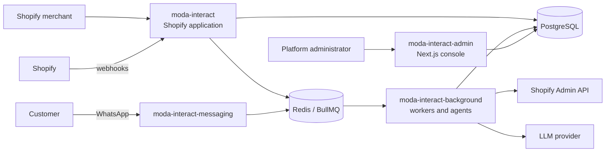

# Moda Interact Architecture Overview

## Purpose

Moda Interact is a multi-service platform that helps Shopify merchants recover
abandoned checkouts and support customers through conversational commerce,
including WhatsApp interactions.

The workspace coordinates independently versioned services. Each service owns a
clear boundary and can be deployed independently.

## System context



## Core principles

- `Shop` and `shopId` are the tenant boundary.
- PostgreSQL is the durable source of truth.
- Redis and BullMQ coordinate asynchronous work; they are not business state.
- Webhook handlers validate, normalise and enqueue quickly.
- `CheckoutRecovery` represents commercial recovery state.
- `Conversation` and `ConversationMessage` represent customer interaction history.
- Usage recording is idempotent and owned by the background processing boundary.
- Shopify remains authoritative for Shopify billing and Shopify resource data.
- Platform-admin access is separate from merchant Shopify authentication.

## Main runtime flows

### Checkout recovery

```text
Shopify checkout webhook
        -> moda-interact
        -> Redis / BullMQ
        -> moda-interact-background
        -> CheckoutRecovery + Conversation
        -> WhatsApp provider
```

### Customer message

```text
WhatsApp / Meta webhook
        -> moda-interact-messaging
        -> validate + normalise
        -> Redis / BullMQ
        -> moda-interact-background
        -> recovery routing + Commerce Agent
        -> Shopify tools / AI provider
        -> WhatsApp response
```

### Platform administration

```text
Platform administrator
        -> moda-interact-admin
        -> authenticated server-side query
        -> PostgreSQL reporting data
```

## Documentation map

- [Service boundaries](services.md)
- [Architecture Decision Records](../decisions/)
- [Cross-service contracts](../contracts/)
