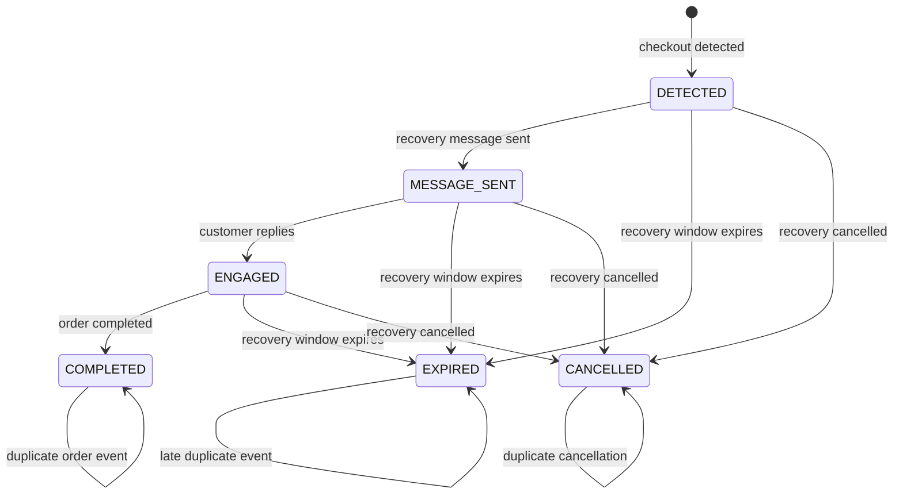

# Runtime Flows

Document the end-to-end runtime behavior of the platform here.

## Checkout recovery lifecycle

`CheckoutRecoveryStatus` is the durable state machine for an abandoned basket.
The database enum is authoritative:



### State meanings

| State | Meaning |
| --- | --- |
| `DETECTED` | Shopify checkout was identified and is eligible for recovery messaging. |
| `MESSAGE_SENT` | The initial recovery message was sent successfully. |
| `ENGAGED` | The customer has interacted with the recovery conversation. |
| `COMPLETED` | An order was completed for the recovery. This is terminal. |
| `EXPIRED` | The recovery window ended without an order. This is terminal. |
| `CANCELLED` | The recovery was intentionally stopped. This is terminal. |

### Order-completed flow

The `orders/create` event is handled as an idempotent state transition:

```text
Order event
	|
	v
Find recovery by shop + checkout identifier
	|
	+--> no recovery: acknowledge and ignore
	|
	+--> COMPLETED: acknowledge duplicate and do nothing
	|
	+--> EXPIRED/CANCELLED: preserve terminal state and do nothing
	|
	+--> DETECTED/MESSAGE_SENT/ENGAGED: transition to COMPLETED
```

The transition must:

- enforce the `shopId` tenant boundary;
- use a stable checkout or order identifier, never a timestamp-based key;
- be safe when Shopify retries the event;
- avoid sending another recovery message; and
- update `completedAt` with the order completion time where available.

### Transition rules

Only these forward transitions are valid:

```text
DETECTED     -> MESSAGE_SENT | EXPIRED | CANCELLED
MESSAGE_SENT -> ENGAGED | EXPIRED | CANCELLED
ENGAGED      -> COMPLETED | EXPIRED | CANCELLED
```

`COMPLETED`, `EXPIRED` and `CANCELLED` are terminal states. Repeated events
should be acknowledged as no-ops rather than treated as errors.

The order worker should not create a recovery when no matching recovery exists.
It should record enough context for diagnosis without logging customer message
content or access tokens.

## Other flows

- checkout recovery
- inbound WhatsApp message processing
- product discovery
- billing and entitlement synchronization
- platform-admin reporting

Use Mermaid diagrams for service-to-service interactions and note retry,
idempotency and failure behavior for each flow.
